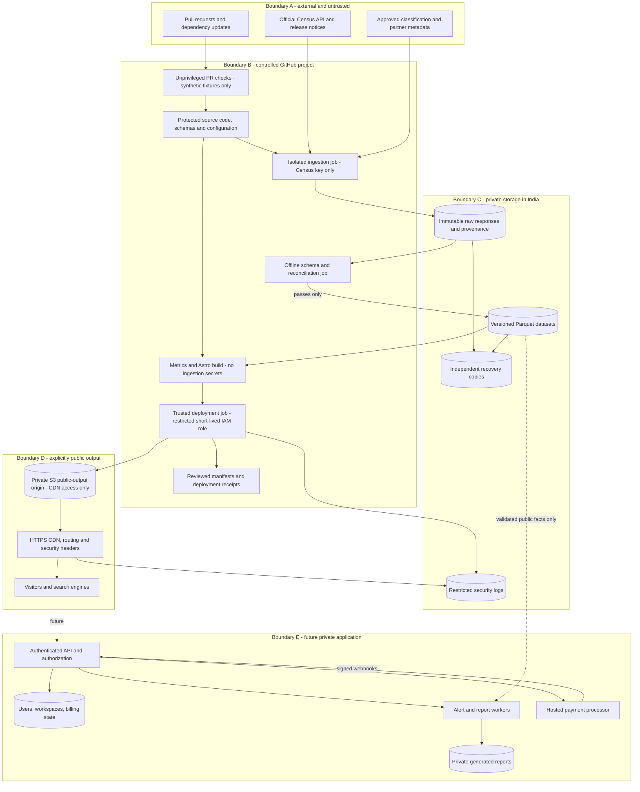

# Architecture

This design keeps request-time computing out of the public analytics path. A visitor receives a complete page and release-pinned data without using a Census credential or waiting for an upstream API.

## Options and decision

| Option | Benefits | Costs and constraints | Decision |
|---|---|---|---|
| Astro + GitHub Actions + private S3 + CloudFront | Static portability; regional archives; short-lived AWS CI credentials; explicit headers, logs and rollback | More IAM/CDN setup; metered traffic and logging; global CDN is not India-only processing | Recommended after Gujarat business confirmation |
| Astro + Actions + Cloudflare Pages/R2 | Very little site operation; immutable deployments and managed rollback | Confirm access to sufficient logs and India archive; provider retention not ours to promise; quotas | Good alternative if logging and contract review pass |
| Server-rendered app + database from day one | Flexible queries and easier later accounts | More availability, patching, backups and privacy work before public demand is known | Defer until paid features justify it |

GitHub Pages is not the commercial host. Its terms expressly restrict online business/commercial SaaS uses. [GitHub Pages limits](https://docs.github.com/en/pages/getting-started-with-github-pages/github-pages-limits)

## Components and trust boundaries

The private origin bucket contains material intentionally available to everyone through the CDN. Its private ACL is an origin protection, not a subscription paywall. Raw archives, logs, workspaces and paid reports live in separate buckets with separate permissions and no public CDN route.

| Component | Responsibility and contract |
|---|---|
| GitHub repository | Reviewed code, source allowlist, schema versions, methodology, lockfiles, CI definitions, small release/deployment records; authoritative desired configuration |
| Ingestor | Acquire approved source partitions; record provenance and bytes; never execute source content |
| Validator | Strict parsing, completeness, uniqueness, referential integrity and statistical reconciliation; emits pass/fail report |
| DuckDB processing | Local batch SQL over Parquet; calculate comparable metrics without a permanent database server |
| Astro builder | Substantive HTML, tables, metadata, sitemap, search index and small release-pinned JSON/CSV |
| Publisher | Verify approved build digest, upload immutable output, verify preview and change active deployment only on success |
| CDN | HTTPS, bounded caching, clean URL handling, headers, 404s and abuse controls; no trade calculations |
| Future API | Identity, workspace authorization, entitlements, billing orchestration and queued work; entirely separate deployment permissions |

## Release protocol

1. A scheduled or manual workflow chooses an allowlisted period range and source version. It checks the approved release calendar. A daily lightweight freshness job is separate from ingestion.
2. Fetch job uses an ephemeral hosted runner. Fixed HTTPS hosts and paths; connect timeout 5 seconds, request timeout 30 seconds, maximum 10 MiB decoded response per partition, maximum 100,000 rows. Split requests when appropriate, never silently truncate. These are initial operational bounds, to be adjusted through review after representative sampling.
3. Retry transient network errors, 429 and 5xx at most three times with jittered backoff and bounded Retry-After. Do not retry schema failures or authorization failures blindly. End the job after 20 minutes; a manual historical backfill uses resumable monthly shards, at most two concurrently, each with the same bound.
4. Save a checksum-addressed raw response and a **sanitized** request specification. Strip API keys and sensitive headers before any metadata/log write. Record a failed partition explicitly.
5. Offline validation has no source or deployment credentials. It compares against the expected partition inventory, not merely the rows received. Missing periods or partners block promotion. A missing row is not a zero unless the source contract proves it.
6. Create a release manifest only after every required partition passes. Its ID derives from the normalized partition hashes, schema version, source metadata and transformation Git commit. Repeating identical processing produces the same content ID and no duplicate observations. Ingestion-attempt timestamps belong to a separate audit record.
7. Build metrics and pages using exactly this manifest. Emit a build ID, release ID, source commit, file inventory and SHA-256 hashes. The builder has no publishing credentials. Build limit: 20 minutes; deploy limit: 10 minutes. Initial ceiling: 5,000 HTML routes, 250 KiB compressed JSON per normal interaction, 100 KiB compressed initial JS, 20 MiB per download shard.
8. A trusted publisher independently validates the inventory and uploads to an unused prefix with conditional writes. Use release-scoped HTML, data and assets. Verify preview HTTP behavior, headers, route availability, sample metrics and hashes before activation.
9. Serialize promotion with a production concurrency group. Reject an unexpected change in the currently deployed ID. Record the accepted manifest in GitHub before activation; then switch the routing configuration to the new immutable build and write the successful deployment receipt. Run post-promotion smoke checks and restore the previous routing configuration on failure. Use a small GitHub App or separate trusted workflow with narrowly scoped write authority for manifests; ingestion and build jobs cannot write source code. If the receipt write fails after a successful activation, alert and recover it from the immutable deployment record; do not ambiguously retry promotion.

No mutable `latest.json` controls calculations in the browser. HTML embeds its release ID and all its data fetches use that ID. A comparison selects one common release for every column. A newer release can be offered as an explicit refresh, never partially spliced into an existing view.

CDN propagation is not a globally simultaneous transaction: different edges may briefly serve different complete releases. The guarantee is that each rendered view and its downloadable results use one internally consistent release. Old release assets remain available throughout cache lifetimes and rollback retention. A failed update leaves the old deployment usable; no purge/delete precedes a successful upload.

## Hosting design and portability

Recommended AWS layout: Mumbai (`ap-south-1`) private raw, normalized and public-output buckets; separate restricted logging bucket; recovery copy in a different account or separately controlled backup destination. S3 public access is blocked. CloudFront Origin Access Control permits access only to intended public output. CloudFront and DNS/TLS remain global services; do not describe this as all data remaining in India. [AWS origin access control](https://docs.aws.amazon.com/AmazonCloudFront/latest/DeveloperGuide/private-content-restricting-access-to-s3.html)

A small CloudFront viewer-request function maps allowed clean paths to `/builds/{build_id}/site/.../index.html`. Explicit immutable data/asset paths bypass that rewrite. The build ID is deployed configuration, not a visitor-controlled value. Reject malformed paths and unsupported methods. A real unknown path yields a 404 page with HTTP 404, never an SPA-style 200. Handle private-S3 missing-object 403 carefully: only the public behavior maps expected missing objects to 404; origin outages and real permission errors must alert, not silently become missing content.

Use pay-as-you-go CloudFront for the required custom cache and response-header policies. The current $15/month Pro flat-rate plan includes logging, but custom cache/origin/header rules are higher-tier features; selecting Pro merely because it is inexpensive would leave a design gap. Re-evaluate flat-rate plans when their supported configuration meets the requirements. [CloudFront pricing](https://aws.amazon.com/cloudfront/pricing/), [feature restrictions](https://docs.aws.amazon.com/AmazonCloudFront/latest/DeveloperGuide/flat-rate-pricing-plan.html)

AWS's customer agreement supports customer applications and governs content, security and service use; the August 14, 2026 version and current service terms were reviewed. No GitHub-Pages-style business-site prohibition was found. This is a suitability assessment, not a contract approval: accept the actual India contracting terms, DPA, subprocessors, tax treatment and chosen plan before provisioning. [AWS agreement](https://aws.amazon.com/agreement/), [service terms](https://aws.amazon.com/service-terms/)

Portability contract: `SITE_ORIGIN`, `BASE_PATH`, `ASSET_ORIGIN`, `PUBLIC_DATA_ORIGIN`, `DEPLOY_PROVIDER`, and `APP_ORIGIN` are configuration. Only trusted build configuration creates canonical URLs; never use the request Host header. Generate links through one URL helper. Test both `/` and `/trade/` builds. Export ordinary HTML/CSS/JS, Parquet, JSON and CSV; keep CDN rules in a thin adapter and infrastructure as code in GitHub. No public URLs contain bucket names or provider account IDs.

The Cloudflare alternative currently has 20,000 files on Free, 25 MiB per asset, 500 builds/month, 20-minute build timeout and header/redirect rule limits. Large history belongs in object storage. Pages headers apply to static responses; a future function must set its own headers. Log availability/retention and residency need a separate check. [Pages limits](https://developers.cloudflare.com/pages/platform/limits/), [headers](https://developers.cloudflare.com/pages/configuration/headers/), [terms](https://www.cloudflare.com/terms/)

## Storage, caching and recovery

| Item | Policy |
|---|---|
| Raw and normalized facts | Immutable objects; monthly partitions with deduplication; preserve releases used in published analyses for at least seven years as a product policy, subject to source terms and storage review |
| Public HTML | Cache-Control public, max-age=0, s-maxage=300; cache keys exclude irrelevant tracking parameters; explicit noindex explorer paths described in experience document |
| Hashed assets and release data | public, max-age=31536000, immutable; never overwrite; CORS limited to intended access where useful, not treated as authorization |
| Release/archive retention | Published data bundles retained at least seven years; latest 12 complete deployment bundles plus releases referenced by durable reports retained; old snapshots outside this contract return clear unavailable status |
| Failed candidates | Private quarantine, 14 days; sanitize evidence; retain failure summary without credentials |
| Backups | Copy each accepted release and deployment bundle to separately controlled backup storage; weekly repository mirror; quarterly restore drill |
| Logs | Security logs initially 180 rolling days in India; select necessary fields, exclude query strings/cookies/authorization; review CERT-In applicability and later DPDP retention before launch |
| CI artifacts/cache | Small artifacts, short retention; no secrets; cache is disposable and cannot be authoritative release input without hash verification |

Recovery objective: restore a prior complete release within one hour of operator response; lose no accepted release. These are targets, not measured SLAs. Rollback republishes the previous routing configuration and verifies its data hashes. Corrupted releases are marked withdrawn, with an explanatory correction record; do not quietly rewrite their bytes. Snapshot pages can return 410 for deliberately withdrawn content while explaining the correction.

Freshness monitoring checks official scheduled dates and expected periods, the deployed manifest, deployment status and log delivery. If the source has a release but the site has not published it within 24 hours, show a warning and alert the operator. At 72 hours escalate. An announced source delay is a different state from pipeline failure. A page shows its data period and official publication date even with JavaScript disabled. A small independently scheduled AWS check covers missed GitHub schedules; GitHub schedules can be delayed or dropped. [GitHub scheduling behavior](https://docs.github.com/en/actions/reference/workflows-and-actions/events-that-trigger-workflows#schedule)

## Budget and limits

Assume 100,000 visits/month, 50 GB transfer, 1–2 million requests, 20 GB deduplicated archive, up to 5 GB compressed logs and under 1,000 Linux CI minutes. Set a provisional **US$25–50/month** envelope: approximately $5–30 CDN/request costs, $2–8 storage/logs/backups, $1–3 domain amortization/DNS, $0–5 CI and monitoring, plus contingency. These ranges are estimates, not quotations; actual region mix, plan credits, retained logs and taxes determine the bill. Archive growth and legal services are separate budgeting decisions.

GitHub private repositories have plan-specific included minutes and storage, with excess usage billed. Use Linux runners, job timeouts, concurrency limits, a monthly backfill cap and budget alerts. Do not depend on unlimited free CI. [GitHub billing](https://docs.github.com/en/billing/concepts/product-billing/github-actions)

Metered AWS budgets are notifications, not guaranteed hard spending caps. Limit expensive downloads, set operational thresholds and alert at 50/80/100% of the approved budget. Monitor bots separately from readership without creating persistent visitor identities. Free/low-cost hosting offers limited support; global access, especially mainland China reachability, must be tested and is not guaranteed. No mainland-China hosting or ICP arrangement is included.

## Future backend boundary

Add one server application, managed PostgreSQL, a managed OIDC identity provider, a durable queue and private report storage. Prefer services with an India region where practicable, while reviewing all cross-border processing. Keep `/products/` and `/countries/` on the static host and put the private application at a configurable `app` origin. Use a provider-neutral billing adapter; Stripe is only a candidate because India onboarding is currently invite-only. [Stripe India status](https://support.stripe.com/questions/stripe-accounts-are-invite-only-in-india)

MVP foundations are stable entity IDs, versioned schemas, public/private build separation, an independent app-origin configuration, structured feature descriptions and source provenance. Do not deploy unused auth, payment webhooks, account tables, queues or a pretend paid tier. Their designs and security acceptance gates are retained in the other documents.
