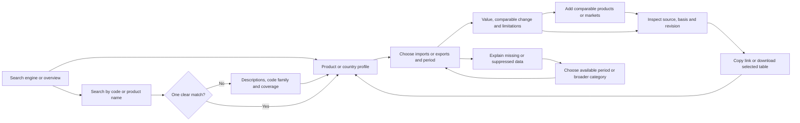
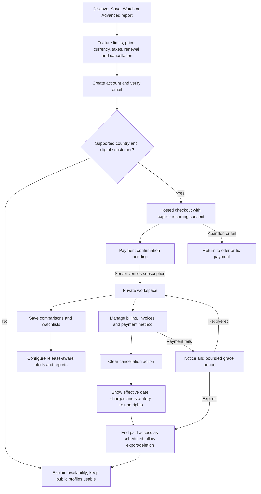

# Experience and SEO

The interface is a light analytical workspace: white surfaces, dark navy text, blue actions, fine grey rules and compact charts. Use tabular numerals, a system font, 16px body text, visible keyboard focus and generous click targets. Avoid decorative imagery and oversized marketing panels. Imports and exports use consistent labels and distinguishable line styles; colour alone never conveys meaning or direction.

## Public journey



Direct entry is the primary design case. A profile must answer, without a homepage visit: what is being measured, which geography and classification are used, what period is shown, what the last release is, which comparisons are valid and what the visitor can do next.

## Navigation and page contracts

| Section | Route and contents | Main action |
|---|---|---|
| Overview | `/`; latest complete common period, imports/exports, leading products/partners, biggest comparable changes, freshness, search | Find a product or country |
| Product search | `/search/`; exact code, name and curated synonyms; code system, edition and hierarchy in results | Open a matching product |
| Product profile | `/products/hs/{edition}/{code}/imports/` and `/exports/`; product definition, time series, markets, source basis and availability | Compare trading partners |
| Country profile | `/countries/{stable-id}/imports/` and `/exports/`; US trade with that partner, leading products and changes | Explore a product |
| Comparisons | `/compare/`; 2–4 series on a common basis; synchronized period, table and downloadable selection | Add another market |
| Recent changes | `/changes/`; measured YoY changes, absolute changes, revision notices, coverage filters | Inspect the underlying series |
| Sources/methodology | `/methodology/`, `/sources/`, `/releases/{release-id}/`; definitions, provenance, formulae, limits and corrections | Reproduce a result |

Also provide privacy, terms, accessibility/contact and status pages. Contact details remain draft placeholders until the operator is identified; a public launch cannot ship fake addresses or unmonitored mailboxes.

## Profile layout

```text
US Trade Explorer                 Search products or countries
Overview  Products  Countries  Compare  Changes  Methodology

Products / HS 2022 / 09
Coffee, tea, maté and spices
US imports • HS chapter 09 • Census basis • nominal USD

Imports [selected]   Exports       Period [latest complete month]
Data period: [month]  Published: [date]  Revision: [date or unknown]

Trade value              Change from same month last year
[value]                  [USD change]  [percentage or explanation]

[Accessible trend chart]         Compare markets   Download table
[Trend data table]

Leading partner countries [sortable table, total and coverage]
What changed [measured statements, revision badges]
Source and limitations [endpoint, variables, release, definitions]
[Advertisement — independently labelled, below useful content]
Related products and next actions
```

This is a layout specification, not populated analytics. Do not place invented numbers in a production-looking mockup. On mobile, controls wrap in reading order, summary blocks stack and tables have a clearly labelled horizontal scroll region. Put a textual chart summary and accessible table next to every chart. Respect reduced motion and 200% text zoom; test keyboard use and screen readers, not just automated scores. Aim at WCAG 2.2 AA as the engineering target; this does not settle each jurisdiction's legal standard.

Each result carries a compact statistical-basis line. All comparisons are expressed from the US perspective: “US imports from Mexico,” not the ambiguous “Mexico imports.” Explain that a country profile is bilateral US trade. Changes are descriptive: “reported value increased 12%” is valid only from actual data; “because of tariffs” needs separate evidence and is never generated from the arithmetic alone.

## Exceptional flows

| Situation | Behavior and recovery |
|---|---|
| Ambiguous name such as “chips” | Show semiconductors and food categories with codes and descriptions. Do not automatically select the most popular interpretation. Prefer exact code matches, then curated synonyms, then text matches. Label relevance, not classification advice. |
| Exact HS6/10 entered outside MVP coverage | Explain available HS2 level and offer its parent. Do not present chapter totals as the requested detailed product. |
| Unknown product/code | Real 404 for an invalid profile URL; search results offer broader terms and source classification links. |
| Missing observation | Em dash with reason “not reported,” “not available,” or “not covered.” A reported zero displays 0. No silent interpolation. |
| Quantity or weight suppressed | Preserve reported value if available; quantity reads “withheld by source.” No unit-price estimate, back-solving or chart that implies zero. |
| Invalid time range or code edition | Explain the boundary and offer a valid period/edition. Preserve the visitor’s intended choice visibly until they accept a change. |
| Stale source or failed update | Keep last valid data with period, official date and warning. Distinguish source delay from processing failure. Link status and earlier releases. |
| Empty comparison | Offer “Add a product or country” and a small set of clearly labelled examples. No meaningless zero chart. One item shows a series and prompts adding another. |
| Incompatible comparison | Block calculation and name the mismatch: unit, adjustment, classification, reporter, release or period. Offer a common basis. |
| Too many comparison series | Limit public comparisons to four; retain existing selection, explain the limit and allow replacement. |
| Download failure | Retain filters and page; retry the same immutable URL; provide table-copy and smaller CSV alternatives. Show size and file type first. Never display success before bytes are received. |
| Release no longer available | Explain retention or withdrawal and link latest valid release. Do not silently change a reproducibility link. |

## URL state and indexing

Canonical profile paths identify classification edition, code/partner and trade flow. A deliberately curated latest-period default is prerendered at each path. Detailed state lives on a separate noindex exploration route, for example:

`/explore/?kind=product&edition=HS2022&code=09&flow=imports&from=2025-01&to=2025-12&release={id}`

`/compare/?product=HS2022:09&partners=CA,MX&flow=imports&period=2025-12&release={id}`

These are illustrative selections, not assertions of released values. Partner URL identifiers map to versioned source codes. Sort and deduplicate URL sets; whitelist parameters, cap their lengths, reject malformed IDs and never put email addresses, names or private workspace contents into URLs. Search query text is treated as potentially personal and excluded from operator access logs. Query string changes do not create additional server-side documents.

| Page class | Indexing and canonical rule |
|---|---|
| Substantive overview and valid base profiles | Indexable, self-canonical absolute HTTPS URL; server-rendered subject, actual data, definitions, links and provenance |
| Query strings on base profiles | Render the same default content; canonical to base path. Filter controls navigate to `/explore/`, eliminating server/client indexing disagreement. |
| Search, explore and arbitrary comparisons | Server-delivered `noindex,follow`; no sitemap entries. Do not block crawling in robots.txt before bots can read noindex. Do not pretend every filtered result is identical to a base profile through contradictory canonicals. |
| Reviewed editorial comparisons | Separate stable `/insights/{slug}/` route, indexable only with substantive original analysis and ongoing maintenance |
| Release/methodology pages | Indexable when useful and substantive; historical dataset files use `X-Robots-Tag: noindex` to avoid thousands of file results |
| Invalid paths | 404; withdrawn material can be 410 with explanation; no soft 404 or catch-all success page |
| Preview deployments | Access restricted plus noindex; avoid discoverable duplicates under provider domains |
| Future private application | Authentication and authorization enforce privacy; noindex is only supplementary |

Generate XML sitemaps from the route inventory, not all filter permutations. `lastmod` reflects material data/content changes. One HTTPS host and slash convention, permanent redirects for true moves, canonical links independent of provider and correct 301/308, 404 and 5xx behavior. Never redirect a retired code to a semantically different replacement; retain an explanatory edition page and concordance links.

Use unique titles such as “US coffee, tea and spice imports — HS 09 | US Trade Explorer,” headings, actual summary paragraphs and crawlable tables. Avoid thousands of template pages with no observations. Use BreadcrumbList and Dataset structured data only where their visible content and published metadata support them. Add `hreflang` only for real maintained translations. Strong SEO means useful, accurately described pages; rankings are not guaranteed.

## Advertising and commercial design

Launch with fixed sponsorship slots, clearly marked Advertisement, after the analytical content begins. Host reviewed sponsor images locally; reject executable markup and tracking pixels. Sponsor links use `rel="sponsored noopener noreferrer"`. No ad may imitate a Download button, interrupt filters, shift a chart or influence data ordering. State sponsor independence and record permitted use of each creative. Sell placement periods rather than promising individual-level targeting or unmeasured impressions. Revenue is uncertain until audience and sponsor demand are measured.

For later ad networks, identify all request recipients and SDK behaviors before choosing a consent platform. Contextual or “non-personalized” ads may still store/read identifiers and need consent. Provide equally usable accept/reject choices where required, withdrawal and applicable sale/share opt-outs; do not load tags before the relevant decision. Useful public pages remain available after rejection. Consent receipts are private operational records, never build assets.

## Subscriber journey



The complete offer explains free versus paid features, exact recurring amount and currency, billing period, any total annual commitment, applicable tax, next charge, refund/withdrawal rights and cancellation route **before** signup and payment. Prices are an unresolved product decision; no invented discount or trial is advertised. Start future billing with a single monthly tier and no automatically converting free trial unless deliberately approved and reviewed.

Create account → verify email → accept applicable terms → separate optional marketing consent → provider checkout. Customer location and business/consumer status are collected for actual billing/legal purposes and validated as necessary; a checkbox cannot extinguish consumer rights. Show “Confirming payment” after provider return until the server confirms paid status. A successful URL query or hidden client flag grants nothing.

Paid workspaces default private. Name the workspace, save the existing public selection, choose whether to follow latest data or pin a release, and explain that revisions can change alerts. An email alert has its own subscription control; marketing is separate. No advertising or tracking pixels run inside private workspaces or report downloads.

Billing remains reachable after paid access expires. Provide invoices, next charge, payment method, cancel and account deletion as distinct actions. Cancellation needs no phone call, retention survey or support ticket. Confirm its effective date immediately and by durable email, and stop scheduled renewal consistently with the processor. Show any paid-through access and statutory withdrawal/refund option separately. Send localized renewal notices on the applicable schedule, including Mexico's current five-calendar-day requirement where applicable. Do not universally promise “no refunds.”

Proposed policy: after expiry, stop paid jobs, keep workspace read-only for 30 days for export or resubscription, then delete workspace content unless a lawful retention exception applies. Explain this before purchase. Public profiles remain accessible. Account deletion revokes sessions, stops alerts, cancels future billing, removes private content and explains limited invoice/legal retention; it is not a substitute for the immediately available cancellation action.
