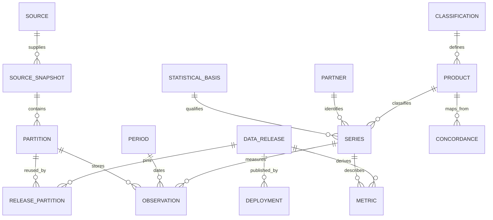

# Data model and statistical method

Use official Census international merchandise trade data as the MVP source. Do not combine a goods-only product series with a goods-and-services headline or mix balance-of-payments and Census bases. Census documents monthly data from 2010 onward and requires API keys for current queries. Initial coverage is a selected 60-month window, with an additional earlier month/year where needed for change calculations. [Census international trade API](https://www.census.gov/data/developers/data-sets/international-trade.html)

## Statistical contract

| Dimension | MVP choice and meaning |
|---|---|
| Reporter | US; source-defined statistical territory, including relevant US coverage rules; not simply residence of the buyer/seller |
| Partner | Imports: country of origin; exports: source destination concept. Retain source identifiers, special areas and aggregates explicitly. |
| Flow and valuation | General imports, customs value; total exports, FAS value. Imports for consumption, CIF value, domestic exports and re-exports are distinct series, not interchangeable labels. |
| Commodity | HS2 for initial pages. Classification system, edition, validity interval and level are always stored. Import HTSUS and export Schedule B detail are not equated beyond supported common HS levels. |
| Adjustment and unit | Nominal current USD, not seasonally adjusted. No inflation-adjusted or real-volume claim. |
| Frequency | Monthly; annual/YTD are derived only from a complete comparable set of months or separately identified official totals. |
| Quantity | Nullable, unit-specific and status-bearing. Default HS2 presentation is value-only; mixed-unit aggregates do not have a meaningful quantity total. |
| Balance | Exports minus general imports on the stated Census/valuation basis; never described as the official BOP goods-and-services balance. |

These distinctions are supported by the [Census trade program definitions](https://www.census.gov/foreign-trade/guide/sec2.html). Statistical values are estimates/administrative compilations subject to reporting limits and revisions, not transaction-level records or causal evidence.

Source variable mapping begins with imports `GEN_VAL_MO` and exports `ALL_VAL_MO`; preserve exact variable names and verify current metadata in the connector contract. `CTY_CODE`, commodity identifiers/descriptions, month/time and quantity/unit fields must be mapped explicitly. Never infer field semantics from names alone. [Import variables](https://api.census.gov/data/timeseries/intltrade/imports/hs/variables.html), [export variables](https://api.census.gov/data/timeseries/intltrade/exports/hs/variables.html)

## Entity relationship diagram

## Entities and keys

| Entity | Required fields and constraints |
|---|---|
| Source | `source_id`, publisher, approved host/path patterns, dataset identifier, variable contract hash, terms URL, attribution text, reviewed date, owner |
| SourceSnapshot | `snapshot_id`, sanitized query, response SHA-256, source resource URL, schema version, official release date and its evidence, revision date if known, retrieval start/end UTC, source availability state |
| Classification | `system`, `edition`, official vintage, effective-from/to, hierarchy rules, source snapshot; no globally timeless HS code |
| Product | Stable composite ID `{system}:{edition}:{code}`, code as **string** preserving leading zeroes, level, description, parent, effective dates, special/pseudo-code flag |
| Concordance | From/to product IDs, relationship `one_to_one/split/merge/partial`, evidence and comparability flag. Never invent split weights. |
| Partner | Stable internal ID, source code string, source name, optional ISO mapping, kind `country/territory/aggregate/special`, validity dates, region membership version |
| StatisticalBasis | Reporter, partner concept, flow, valuation, coverage, seasonal adjustment, currency/unit, frequency, source program and methodology version |
| Series | Product, partner and basis keys, total/leaf marker, optional transport/district dimensions fixed to source-defined all in MVP; unique normalized dimension tuple |
| Period | `YYYY-MM`, start/end dates, frequency, year; never use ingestion date as observation date |
| Observation | Series ID, period, decimal/integer value, status, quantity1/2 and units/statuses, snapshot/partition ID, source variable name; unique `(partition, series, period)` |
| Partition | Immutable normalized object URI, checksum, row count, schema version, source snapshots, expected coverage inventory, bounds and validation report |
| DataRelease | Content ID, schema/transform Git commit, required partition hashes, coverage, source publication/revision metadata, computed time, validation status, previous release, change summary |
| Metric | Release, series/set, period/window, formula version, value and status, comparability/coverage flags, input hashes |
| Deployment | Build ID, release ID, source commit, output hashes, prior deployment, activated UTC, smoke-test report, rollback/withdrawal status |

The same logical observation can have multiple vintages across releases. A release selects exactly one partition for each required coverage slot. Enforce uniqueness after assembling a release as well as within each partition. Archive source payloads; never overwrite old observations to simulate “latest.”

## Four different dates

- **Data period:** when measured trade occurred, such as July of a stated year.
- **Official release date:** when the publisher announced the relevant data; store the supporting official notice or calendar reference.
- **Official revision date:** when the publisher revised that observation/vintage, if explicitly available.
- **Ingestion time:** when our system fetched it, in UTC.

Also store `revision_detected_at` when hashes differ without an explicit official revision date. Do not relabel this detection as the official date. Every public profile and CSV metadata sidecar exposes the distinction; unknown dates are explicitly unknown.

Re-fetch the latest three periods in normal refreshes as an initial safety window, while following the actual program revision notices. An annual revision triggers a bounded backfill of **all announced affected years**, not merely the preceding year. Re-fetching unchanged history deduplicates hashes. A monthly data movement compares periods in one release; a revision movement compares the same observation across two releases. Give them separate labels and recent-change lists.

## Missingness and validation

Observation states are `reported`, `reported_zero`, `suppressed`, `not_available`, `not_applicable`, and `not_reported`. Parse source suppression markers using a versioned mapping; do not assume a zero-shaped marker is a numerical zero. Unknown marker/schema changes fail closed for the affected candidate. Quantity suppression must not remove a separately reported trade value.

Reject duplicate keys, malformed dates/codes, nonfinite values, unexpected negative gross trade values, oversized descriptions, invalid hierarchy relations and mismatched units. Retain source text as plain text; do not trust it as markup. Source arrays/header layouts require validation before row parsing. Empty successful responses need a declared reason and expected coverage, not a blanket pass.

Reconciliation uses an approved control table with identical flow, valuation, period, geography and classification coverage. Confirm control availability on the first live ingest. Never reconcile to a seasonally adjusted goods-and-services headline. Exclude aggregate codes from leaf sums and never add parent and child totals together. Special classifications, confidential groupings and statistical adjustments can mean not all decompositions are exact; document residuals rather than manufacturing a balancing observation.

For identities documented as exact, tolerance is zero at stored precision. For source-rounded controls, tolerance is a declared bound derived from rounding units and row count. Any wider residual needs a reviewed rule with a reason and expiry; there is no arbitrary “within 5%” success rule. Major changes trigger review but are not automatically invalid: trade can actually change sharply. Both schema correctness and meaningful coverage checks must pass.

## Metric definitions

| Metric | Definition and guard |
|---|---|
| Absolute change | `current - comparison`, same basis and comparable code, within one release |
| YoY percentage | `(value_t / value_t_minus_12 - 1) * 100`, only if prior value > 0 and both available |
| Zero baseline | Show absolute increase and “percentage not defined from zero”; two zeroes display no absolute change, percentage unavailable |
| MoM percentage | Same guard; labelled unadjusted and potentially seasonal; YoY is default |
| Market share | Partner value / source-consistent world total; do not use sum of displayed top countries as denominator |
| YTD | January through selected month against the same months of prior year; require complete comparable coverage |
| Rolling 12 months | Complete latest 12 months versus preceding 12, with comparability across classification changes |
| Rank | Rank only eligible comparable observations; deterministic ties; disclose exclusions and coverage |
| Unit value | Deferred by default; only compatible, nonsuppressed quantities and units; never call it a market price |

Use integer dollars or exact decimal representations for aggregates; avoid floating-point accumulation and JavaScript integer overflow. Serialize large values as decimal strings and format deliberately. UI rounding happens after calculation; downloads preserve defined precision. Decimal and rounding modes are part of the formula version.

An HS edition break produces a marked gap unless an official concordance supports a valid aggregate. A shared code string is not proof that definitions stayed the same. Retired categories retain historical pages and validity notices. Pseudo-codes and non-country areas stay visible with accurate labels rather than being silently dropped.

## Public exports and future private records

The [operating-model decision](../decisions/2026-10-02-operating-model.md) prefers object/Parquet storage for larger analytical facts and optional D1 only for smaller metadata/lookups where it fits. No analytical database or new schema is implemented by this instruction update. All existing canonical/public/private contracts remain unchanged.

Public compact datasets contain only publication-approved statistical fields. CSVs include release ID, period, basis, status and attribution/source metadata, with a JSON sidecar for full provenance. Protect all text cells against formula injection: escape CSV structure, quote fields, neutralize leading control/whitespace followed by `=`, `+`, `-` or `@`; treat validated numeric cells separately so legitimate negative balances remain numbers. Test Excel and LibreOffice import behavior. A future XLSX export must explicitly encode descriptions as string cells.

Planned initial local records cover saved products/countries, named non-overlapping HS baskets and reusable views. They need versioned query/classification identities and explicit pinned/latest release policy, local validation and clear/export controls. Use localStorage or IndexedDB where appropriate, without accounts solely for saving; do not silently synchronize or treat browser storage as secure tenant storage. Preserve underlying observations and prevent broad HS categories plus descendants from being added twice.

Later private application records may include `User`, `Workspace`, `Membership`, `SavedQuery`, `Watchlist`, `AlertRule`, `AlertDelivery`, `Report`, `Subscription`, `Entitlement`, `BillingEvent`, `ConsentReceipt` and `AuditEvent`; choose storage only when that approved phase needs it. Every workspace resource includes its tenant key and server-checked membership. A saved query records query-schema version and pinned/latest release policy, not a public URL containing private notes. Reports carry release and formula versions. The public static builder has neither database credentials nor a path that can serialize these records.
